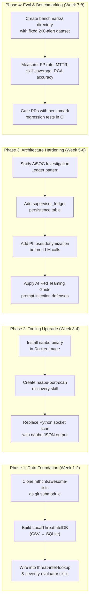

# Repository Review & Integration Analysis for AI-Assisted SOC

## Your Vision: "Add AI IN the SOC, not just USE AI"

Your current platform already does what most SOC tools don't — it has an **autonomous ReAct Supervisor** that *drives* investigation, not just assists it. The repos below are evaluated through this lens: **does this tool become smarter when an AI agent controls it, or is it just another CLI tool?**

---

## Tier 1: HIGH Impact — Direct Integration Value

### 🏆 1. [beenuar/AiSOC](https://github.com/beenuar/AiSOC) — **Your Closest Competitor**

> **What it is:** An open-source AI SOC with LangGraph orchestration, Investigation Ledger, and eval harness. MIT-licensed, v7.7.0, production-grade with Docker/K8s/Terraform.

> [!IMPORTANT]
> This is NOT a tool to integrate — this is the project most similar to yours in the entire open-source ecosystem. Study it for architecture patterns, not for code reuse.

**What they do that you should learn from:**

| AiSOC Feature | Your Project Status | Gap & Action |
| :--- | :--- | :--- |
| **Investigation Ledger** — every LLM prompt, response, evidence cited, and tool call is logged and replayable | ❌ You don't persist the Supervisor's chain-of-thought decisions | **Add a `supervisor_ledger` table** that records each `SupervisorDecision` with the full prompt sent and response received |
| **Public Eval Harness in CI** — 1,000-alert benchmark stream with scored reduction metrics | ❌ You have 132 unit tests but no adversarial benchmark | **Create a `benchmarks/` directory** with a fixed 200-alert dataset and measure: FP suppression rate, mean-time-to-RCA, skill coverage |
| **Pseudonymized evidence** — internal IPs, hostnames, emails become opaque tokens before hitting the LLM | ❌ Your prompts send raw entity IDs to the LLM | **Add a `PII sanitizer` layer** in `prompt_manager.py` before any external LLM call |
| **`npx aisoc triage --demo`** — zero-key deterministic triage in one command | ✅ Your End-to-End Demo page does this via the UI | Could add a CLI entry point for headless demo |

---

### 🏆 2. [mthcht/awesome-lists](https://github.com/mthcht/awesome-lists) — **Massive Threat Intel Dataset**

> **What it is:** 50+ continuously updated CSV detection lists: suspicious TLDs, ransomware file extensions, C2 named pipes, VPN exit IPs, Tor nodes, malicious SSL certs, LOLDrivers hashes, phishing domains.

> [!IMPORTANT]
> This is the single highest-value integration for your project. It directly solves the problem you saw where `raindrop.ps1` and `192.168.0.4` both scored `risk_score: 0.1` because your threat intel had no local reference data.

**Concrete integration plan:**

```
Your Phase          What to Import from awesome-lists            Where in Code
─────────────      ──────────────────────────────────────        ──────────────────
Triage              suspicious_http_user_agents_list.csv         → ioc-extractor skill
                    suspicious_TLDs/                             → threat-intel-prefilter skill
                    ransomware_extensions_list.csv               → severity-evaluator skill
                    ransomware_notes_list.csv                    → severity-evaluator skill

Evidence            suspicious_named_pipe_list.csv               → edr-process-tree skill
                    suspicious_windows_services_names_list.csv   → persistence-auditor skill
                    suspicious_windows_tasks_list.csv            → persistence-auditor skill
                    hijacklibs_list.csv                          → file-forensics skill (DLL hijack detection)
                    loldrivers_only_hashes_list.csv              → file-forensics skill

Evidence/TI         TOR/tor_exit_nodes_list.csv                  → threat-intel-lookup skill
                    VPN/nordvpn_ips_list.csv + protonvpn...      → threat-intel-lookup skill
                    Phishing/                                    → threat-intel-lookup skill
                    ssl_certificates_malicious_list.csv          → network-flow-analyzer skill

Compression         suspicious_ports_list.csv                    → behavioral-anomaly-filter skill
```

**Implementation:** Create a `backend/services/threat_intel/local_feeds/` directory, clone the repo as a git submodule, and build a `LocalThreatIntelDB` class that loads CSVs into SQLite for fast hash/IP/domain lookups during evidence enrichment.

---

### 🏆 3. [projectdiscovery/naabu](https://github.com/projectdiscovery/naabu) — **Production Port Scanner (Go)**

> **What it is:** High-speed SYN/CONNECT port scanner written in Go. Supports SYN scan, service detection, CDN/WAF exclusion, Nmap integration, JSON/CSV output, stdin piping, and host discovery.

**Why this matters for your project:**

Your current `NetworkDiscoveryAgent` uses Python `asyncio.open_connection()` to scan ports one by one. Naabu can scan **thousands of ports across hundreds of hosts in seconds** using raw SYN packets.

**Integration as a Discovery Skill:**

```yaml
# backend/services/discovery/skills/naabu-port-scan/SKILL.md
---
name: naabu-port-scan
description: High-speed SYN port scan using ProjectDiscovery's naabu
version: 1.0.0
phase: discovery
method: command
commandTemplate: naabu -host {{target}} -top-ports 1000 -json -silent
commandTemplateFallback: naabu -host {{target}} -p 22,80,443,3389,445,8080 -json -silent
platform: linux
collects:
  - open_ports
  - hostname
---
```

> [!TIP]
> Naabu outputs structured JSON per-host, which your `DiscoveryAgent._discover_host()` parser can consume directly. This replaces the slow Python socket loop while keeping the same skill interface.

---

## Tier 2: MEDIUM Impact — Selective Value

### 4. [evyatarmeged/Raccoon](https://github.com/evyatarmeged/Raccoon) — **OSINT Reconnaissance Scanner**

> **What it is:** Offensive recon tool: DNS records, WHOIS, TLS certs, subdomain enumeration, WAF detection, dir fuzzing, S3 bucket discovery. Python, asyncio-based.

**Selective value for your project:**

| Raccoon Module | Maps to Your Phase | Integration Approach |
| :--- | :--- | :--- |
| DNS records + WHOIS | Discovery (`nslookup-dns`, `whois-lookup`) | Your existing skills already cover this |
| Subdomain enumeration | Discovery (NEW skill) | Could add a `subdomain-enum` discovery skill that wraps Raccoon's subdomain module |
| WAF detection | Discovery (NEW skill) | Useful when investigating web-facing IOCs — "Is this C2 behind Cloudflare?" |
| TLS certificate SANs | Evidence (`network-flow-analyzer`) | Extract Subject Alternative Names from TLS certs to discover related domains |

**Verdict:** Cherry-pick the **subdomain enumeration** and **TLS SAN extraction** modules. Don't integrate the full tool — most other features duplicate your existing discovery skills.

---

### 5. [edoardottt/cariddi](https://github.com/edoardottt/cariddi) — **Web Crawler for Hidden Endpoints**

> **What it is:** Go-based web crawler that discovers hidden endpoints, API keys in HTML/JS, secrets in source code, and error messages. Outputs JSON.

**Selective value:**

This tool is relevant when your Evidence phase discovers a **web application** IOC (a suspicious internal web service, a compromised admin panel, or a C2 domain serving HTTP). Cariddi could automatically crawl the target and extract:
- Hardcoded API keys / tokens in JavaScript
- Error messages revealing internal architecture
- Hidden admin endpoints

**Integration:** Add a `web-crawler` evidence skill with `method: command` that wraps `cariddi -u {{target_url}} -json -secrets`. Triggered when the Supervisor's Evidence phase encounters an HTTP-serving entity (Port 80/443 open from Discovery).

---

### 6. [rshipp/awesome-malware-analysis](https://github.com/rshipp/awesome-malware-analysis) — **Reference Catalog**

> **What it is:** Curated list of malware analysis tools, sandboxes, disassemblers, network analysis tools, and threat intel platforms.

**Value:** This is a **reading list**, not code to integrate. But it identifies tools your `file-forensics` and `edr-process-tree` skills could delegate to:

| Category | Tools to Consider | Your Phase |
| :--- | :--- | :--- |
| Online Scanners | VirusTotal, Hybrid Analysis, ANY.RUN | Evidence (`threat-intel-lookup`) — you already model VT API calls |
| Memory Analysis | Volatility, Rekall | Evidence (future `memory-forensics` skill) |
| Static Analysis | YARA rules, PEiD, ssdeep | Evidence (`file-forensics`) — add YARA rule matching |

---

## Tier 3: LOW Direct Impact — Knowledge / Future Reference

### 7. [requie/AI-Red-Teaming-Guide](https://github.com/requie/AI-Red-Teaming-Guide) — **Adversarial Testing Guide for AI Systems**

> **What it is:** Comprehensive guide to red-teaming AI systems. Covers NIST AI RMF, OWASP GenAI Top 10, MITRE ATLAS, prompt injection attacks, jailbreaking, and agentic system failure modes.

**Relevance to your project:**

This is not a tool — it's a **security audit framework for YOUR AI agents**. Since your platform uses LLM-driven decisions (Supervisor, Triage, RCA, Response), this guide helps you answer:
- Can an attacker craft a malicious alert that tricks the Supervisor into skipping containment?
- Can a poisoned log entry cause the RCA agent to misattribute the root cause?
- Can prompt injection in a hostname field (`"; DROP TABLE events; --"`) escape into your LLM prompts?

> [!WARNING]
> **Action:** Read the "Agentic Failure-Mode Taxonomy" section and apply it to your `supervisor.py` and `prompt_manager.py`. Add input sanitization to `_sanitize_entity_id()` to block prompt injection via entity names.

---

### 8. [MorDavid/BruteForceAI](https://github.com/MorDavid/BruteForceAI) — **AI-Powered Login Brute Force Tool**

> **What it is:** LLM-powered brute-force tool that uses AI to identify login form selectors, then executes multi-threaded credential attacks with evasion techniques.

**Relevance:** This is an **offensive/red-team** tool. It's NOT something you integrate into a defensive SOC platform. However, it demonstrates an important concept:

> *"AI doesn't just analyze attacks — it can generate and execute them."*

**Indirect value:** Understanding how BruteForceAI works can help you build better **detection rules** in your Triage phase. For example, your `severity-evaluator` skill could detect BruteForceAI's attack patterns:
- Rapid sequential login attempts with rotating User-Agents
- Synchronized delays with jitter (AI-generated evasion timing)
- Webhook callbacks to Discord/Slack after successful credential theft

---

## Summary: Priority Roadmap



| Priority | Repo | Action | Impact |
| :---: | :--- | :--- | :--- |
| 🥇 **1** | **mthcht/awesome-lists** | Clone + build `LocalThreatIntelDB` | Fixes the `0.1 risk score` problem — entities will match against 50+ real-world threat feeds |
| 🥈 **2** | **projectdiscovery/naabu** | Add as discovery skill | 100x faster port scanning, production-grade SYN scan |
| 🥉 **3** | **beenuar/AiSOC** | Study architecture patterns | Investigation Ledger, eval harness, PII sanitization |
| 4 | **requie/AI-Red-Teaming-Guide** | Security audit your LLM agents | Protect against prompt injection and adversarial alerts |
| 5 | **evyatarmeged/Raccoon** | Cherry-pick subdomain enum + TLS SAN extraction | Expand OSINT capability in Discovery phase |
| 6 | **edoardottt/cariddi** | Add web-crawler evidence skill | Auto-crawl HTTP targets for exposed secrets |
| 7 | **rshipp/awesome-malware-analysis** | Reference catalog for future skills | YARA rules, memory forensics, sandbox integration |
| 8 | **MorDavid/BruteForceAI** | Study attack patterns for detection | Build better brute-force detection rules |

> [!IMPORTANT]
> ## The Key Insight
> Your project's unique advantage is the **ReAct Supervisor loop** — AI that *drives* the investigation, not just responds to queries.
>
> The repos above are mostly **tools** (scanners, crawlers, wordlists). They become powerful when your AI Supervisor can **dynamically decide** to invoke them based on live forensic findings.
>
> **Example:** The Supervisor discovers an unknown external IP → triggers `naabu` port scan → finds HTTP open → triggers `cariddi` web crawl → discovers hardcoded API key → triggers `reset-credentials` response skill. No human intervention. That's "AI IN the SOC."
